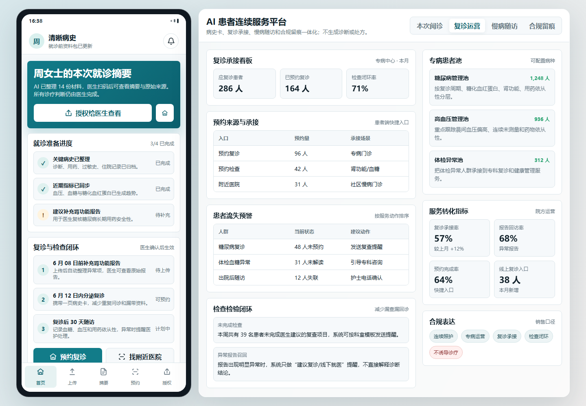

# MediFollow AI Care Continuity

中国医疗 AI 随访助手原型：清晰病史。

## Why It Matters

复诊、慢病随访和检查闭环经常卡在资料不完整、患者忘记预约、医生看不到上下文、合规留痕不清楚。这个原型把患者端病史整理、医生端摘要查看、复诊承接、慢病随访、预约入口和授权审计放在同一个连续服务流程里。

## Highlights

- 患者端：上传材料、生成一页病史摘要、准备问医生清单
- 医生端：查看 AI 整理摘要、原始材料、指标趋势和安全提醒
- 复诊运营：应复诊患者、预约完成、检查检验闭环和患者流失预警
- 慢病随访：异常患者清单、随访问卷、任务分配和科室看板
- 合规边界明确：不自动生成诊断、处方或治疗建议，医生确认后才可引用

## Demo

Open `index.html` in a browser, or publish this repository with GitHub Pages.

## Project Team

This project was co-created by DanXian and Codex.

制作人员：

- DanXian: product direction, healthcare workflow framing, and collaboration
- Codex: AI-assisted prototyping, frontend implementation, and README preparation

## Suggested Topics

`ai-healthcare`, `patient-followup`, `care-continuity`, `chronic-care`, `medical-prototype`, `github-pages`

