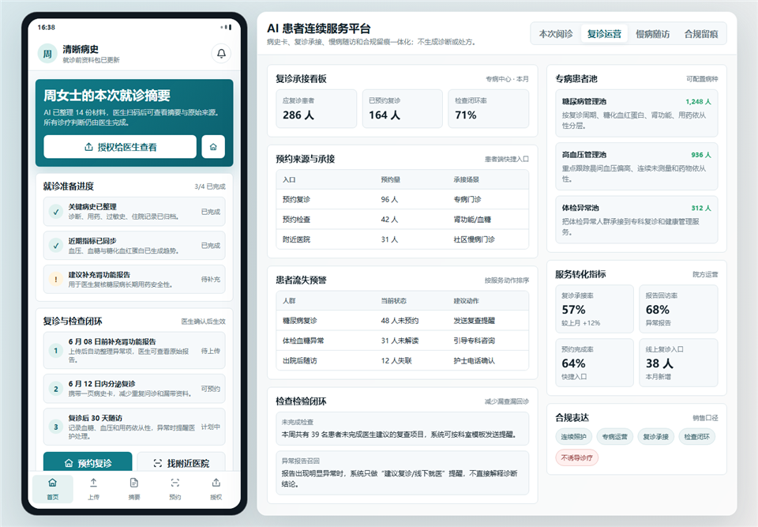
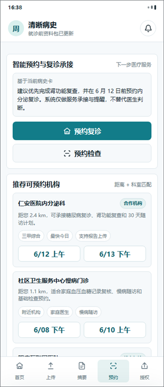

# MediFollow AI Care Continuity

An AI care-continuity prototype for patient history summaries, follow-up operations, chronic-care workflows, appointment handoff, and clinical audit trails.

[Live Demo](https://zhihaohu1996.github.io/medifollow-ai-care-continuity/) · [Repository](https://github.com/Zhihaohu1996/medifollow-ai-care-continuity)

  

## Overview

MediFollow AI Care Continuity explores how hospitals, clinics, and chronic-care teams can connect the gap between patient preparation, doctor review, follow-up reminders, and compliant service operations.

The prototype includes both patient-facing and clinician-facing views. Patients prepare visit materials and generate a one-page history summary. Clinicians review AI-organized context, original source materials, safety reminders, follow-up queues, and audit records.

## Key Features

- Patient-side visit preparation and document upload flow
- One-page history summary for doctor review
- Doctor-side AI summary with original material traceability
- Follow-up and revisit operations dashboard
- Chronic-care queue with abnormal-patient prioritization
- Appointment handoff for follow-up visits and recommended checks
- Compliance-first design: no automatic diagnosis, prescription, or treatment decision

## Screenshots

  
   
  

## Who It Is For

- Healthcare product teams exploring AI-assisted follow-up workflows
- Clinics and hospitals designing patient continuity services
- Chronic-care teams managing revisit and monitoring queues
- Builders interested in compliant AI healthcare UX patterns

## Project Status

This is a high-fidelity static prototype for product exploration, demo conversations, and workflow validation. It does not provide medical advice.

## Roadmap Ideas

- Add role-based accounts for patient, doctor, nurse, and admin views
- Connect structured patient timelines to a backend database
- Add consent management and audit-log export
- Add configurable follow-up templates by department
- Add integration stubs for appointment systems and patient portals

## Team And Contributions

- Zhihao Hu: project owner, product vision, healthcare workflow framing, follow-up business model thinking, compliance boundary definition, feature prioritization, and final project direction
- DanXian: collaborator, healthcare scenario discussion, user-flow feedback, and product refinement
- Codex: AI-assisted implementation support, static frontend assembly, README formatting, and screenshot preparation

## License

MIT License. See [LICENSE](./LICENSE).
